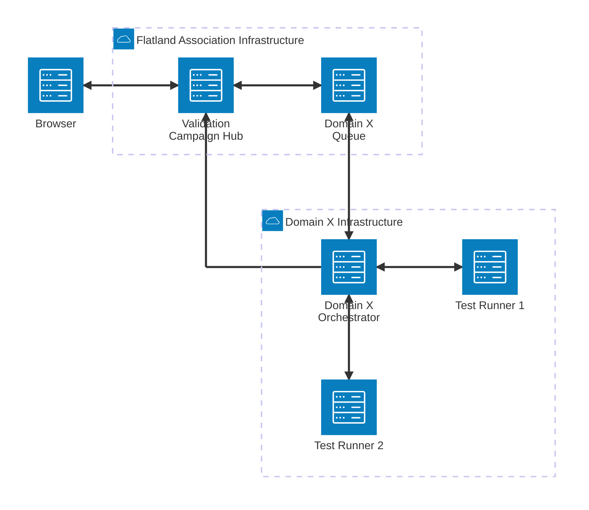
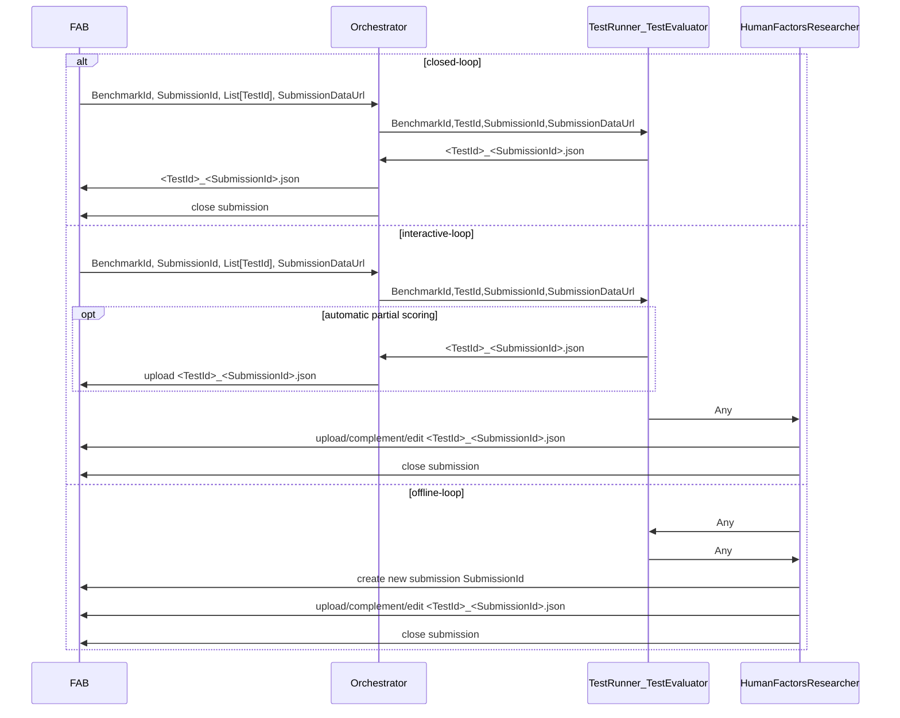

# AI4REALNET Validation Campaign Hub Orchestrator

AI4REALNET Campaign Hub Orchestrator integrates with Validation Campaign Hub (aka. FAB).

This repo contains the domain-specific orchestrator and test runner implementations.

It uses the Python library [fab-clientlib](https://pypi.org/project/fab-clientlib/) to upload results to the Validation Campaign Hub (FAB).

> [!TIP]
> This repo is run [trunk-based](https://www.atlassian.com/continuous-delivery/continuous-integration/trunk-based-development) using shared `main` branch as "
> trunk" and prs to merge only short-lived feature branches into the "trunk"

## Organization and Responsibilities

1. The campaign benchmarks are set up in the Validation Campaign Hub by domain-specific project managers (TU Delft, RTE, Flatland) together with FLATLAND IT
   administrator.
2. The domain-specific orchestrators are configured and deployed by the domain-specific IT administrators: see `orchestrator.py` in the blueprint
3. Experiments (Test Runners, Test Evaluator) are implemented by KPI Owners: see `test_runner_evaluator.py` in the blueprint.
4. Experiments are carried out by Algorithmic Researchers, Human Factors Researchers and results are uploaded as a submission to FAB.

## Experiment Workflows

* **offline-loop**: manually upload your test results (JSON) via
  * FAB UI to initiate a submission
    * FAB REST API using Python FAB Client Lib
* **closed-loop**:
  * Algorithmic Researcher starts experiment from hub
  * Orchestrator uploads results (JSON) to hub and closes submission
* **interactive-loop**:
  * Human Factors Researcher starts experiment from hub
  * Orchestrator uploads results (JSON) to hub
    * Human Factors Researcher complements submission manually via FAB UI or Python CLI
    * Human Factors Researcher closes submission manually

> [!TIP]
> Beware that interactive-loop is meant here from a technical perspective:  
> For closed-loop and interactive-loop, a message is sent to the Domain Orchestrator's queue, whereas no message is sent in the offline-loop case.
> An interactive-loop, some results are uploaded automatically as in closed-loop and some results are entered manually as in offline-loop. The submission is
> published manually when the results are complete.
> An offline-loop can involve an interactive experiment, but the results are entered manually in the campaign hub via the Web UI.

## Architecture

The following diagram gives an overview of the roundtrip from triggering an experiment in the browser to
a test runner running the experiment in the domain X infrastructure.



Domain Queue names according to [KPI-cards](https://github.com/AI4REALNET/KPIs-cards/blob/main/data/card-data.ts), with white spaces removed.

* `Railway`
* `ATM`
* `PowerGrid`

Arrows indicate information flow and not control flow.



## TL;DR;

### Start Domain-Specific Orchestrator for Interactive-Loop and Closed-Loop Experiments

In your domain-specific infrastructure:

1. Clone this repo.
2. Implement orchestrator:

- In your `<domain>/orchestrator.py`, uncomment the test runner for the KPI you want to implement
  - Implement the test runner:
    ```python
    from ai4realnet_orchestrators.test_runner import TestRunner
    def load_submission_data(submission_data_url: str):
        raise NotImplementedError()
  
    def load_model(submission_data):
      raise NotImplementedError()
  
    def load_scenario_data(scenario_id: str):
      raise NotImplementedError()
    
    class YourTestRunner(TestRunner):
      def init(self, submission_data_url: str):
        super().init(submission_data_url=submission_data_url)
        submission_data = load_submission_data(submission_data_url)
        self.model = load_model(submission_data)
  
      def run_scenario(self, scenario_id: str, submission_id: str):
        # here you would implement the logic to run the test for the scenario:
        scenario_data = load_scenario_data(scenario_id)
        model = self.model
  
        # data and other stuff initialized in the init method can be used here
        # for demonstration, we return a dummy result
        return {
          "primary": -999,
        }
    ```
    * `load_scenario_data`: map the `scenario_id` to your test configuration, e.g. path to data you want to load for the KPI
    * `load_submission_data`: get the submission data from the string, e.g. parse the opaque `submission_data_url` string or fetch data from URL
    * `load_model`: load the model from the submission data, e.g. pull a Docker image from a remote registry
    * `return` a dict containing the scenario scores (floats); by default, there is one field called `primary`;
      * please contact Flatland Association if you need to change or have secondary fields as well.
      * the full configuration can be found [here (json)](https://github.com/flatland-association/flatland-benchmarks/blob/main/definitions/ai4realnet/ai4realnet_definitions.json) and [here (sql)](https://github.com/flatland-association/flatland-benchmarks/blob/main/definitions/ai4realnet/ai4realnet_definitions.sql)


3. Run orchestrator: The following command loads the railway orchestrator in the background:

```shell
export DOMAIN="Railway"
export BACKEND_URL=rpc://
export BROKER_URL=amqps://<USER - get it from Flatland>:<PW - get it from Flatland>@rabbitmq-int.flatland.cloud:5671//
export CLIENT_ID=<get it from Flatland>
export CLIENT_SECRET=<get it from Flatland>
export FAB_API_URL=https://ai4realnet-int.flatland.cloud:8000
export RABBITMQ_KEYFILE=.../certs/tls.key # get it from Flatland
export RABBITMQ_CERTFILE=.../certs/tls.crt # get it from Flatland
export RABBITMQ_CA_CERTS=.../certs/ca.crt # get it from Flatland
...


conda create -n railway-orchestrator python=3.13
conda activate railway-orchestrator
python -m pip install -r requirements.txt -r ai4realnet_orchestrators/railway/requirements.txt
python -m celery -A ai4realnet_orchestrators.railway.orchestrator worker -l info -n orchestrator@%n -Q ${DOMAIN} --logfile=$PWD/railway-orchestrator.log --pidfile=$PWD/railway-orchestrator.pid --detach
```

See https://docs.celeryq.dev/en/stable/reference/cli.html#celery-worker for the available options to start a Celery worker.
In particular, use `concurrency` option to determine the worker pool size.


