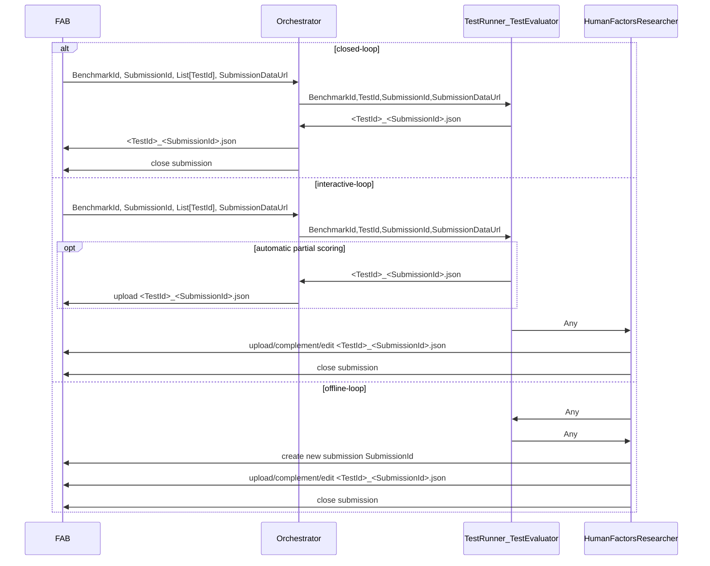

# AI4REALNET Validation Campaign Hub Orchestrator

AI4REALNET Campaign Hub Orchestrator integrates with Validation Campaign Hub (aka. FAB).

This repo contains the domain-specific orchestrator and test runner implementations.

It uses the Python library [fab-clientlib](https://pypi.org/project/fab-clientlib/) to upload results to the Validation Campaign Hub (FAB).

## Organization and Responsibilities

1. The campaign benchmarks are set up in the Validation Campaign Hub by domain-specific project managers (TU Delft, RTE, Flatland) together with FLATLAND IT
   administrator.
2. The domain-specific orchestrators are configured and deployed by the domain-specific IT administrators: see `orchestrator.py` in the blueprint
3. Experiments (Test Runners, Test Evaluator) are implemented by KPI Owners: see `test_runner_evaluator.py` in the blueprint.
4. Experiments are carried out by Algorithmic Researchers, Human Factors Researchers and results are uploaded as a submission to FAB.

## Experiment Workflows

* **offline-loop**: manually upload your test results (JSON) via
    * FAB UI
    * FAB REST API using Python FAB Client Lib
* **closed-loop**:
    * Algorithmic Researcher starts experiment from hub
    * Orchestrator uploads results (JSON) to hub and closes submission
* **interactive-loop**:  manually upload your test results (JSON) via
    * Human Factors Researcher starts experiment from hub
    * orchestrator uploads results (JSON) to hub
    * Human Factors Researcher complements submission manually via FAB UI or Python CLI
    * Human Factors Researcher closes submission manually

## Architecture

Arrows indicate information flow and not control flow.



## TL;DR;

### Start Domain-Specific Orchestrator for Interactive-Loop and Closed-Loop Experiments

In your domain-specific infrastructure:

1. Clone this repo.
2. Run orchestrator: The following command loads the `orchestrator` module from `orchestrator.py` and starts a worker pool of size 5 (`concurrency` option):

```shell
export BENCHMARK_ID=<get it from Flatland>
export BACKEND_URL=rpc://
export BROKER_URL=amqps://<USER - get it from Flatland>:<PW - get it from Flatland>@rabbitmq-int.flatland.cloud:5671//
export CLIENT_ID=<get it from Flatland>
export CLIENT_SECRET=<get it from Flatland>
export FAB_API_URL=https://ai4realnet-int.flatland.cloud:8000
export RABBITMQ_KEYFILE=.../certs/tls.key # get it from Flatland
export RABBITMQ_CERTFILE=.../tls.crt # get it from Flatland
export RABBITMQ_CA_CERTS=.../ca.crt # get it from Flatland
...

conda activate railway-orchestrator
python -m celery -A ai4realnet_orchestrators.railway.orchestrator worker -l info -n orchestrator@%n --soft-time-limit  600 --time-limit 720 --concurrency 5 -Q ${BENCHMARK_ID}
```

See https://docs.celeryq.dev/en/stable/reference/cli.html#celery-worker for the available options to start a Celery worker.


